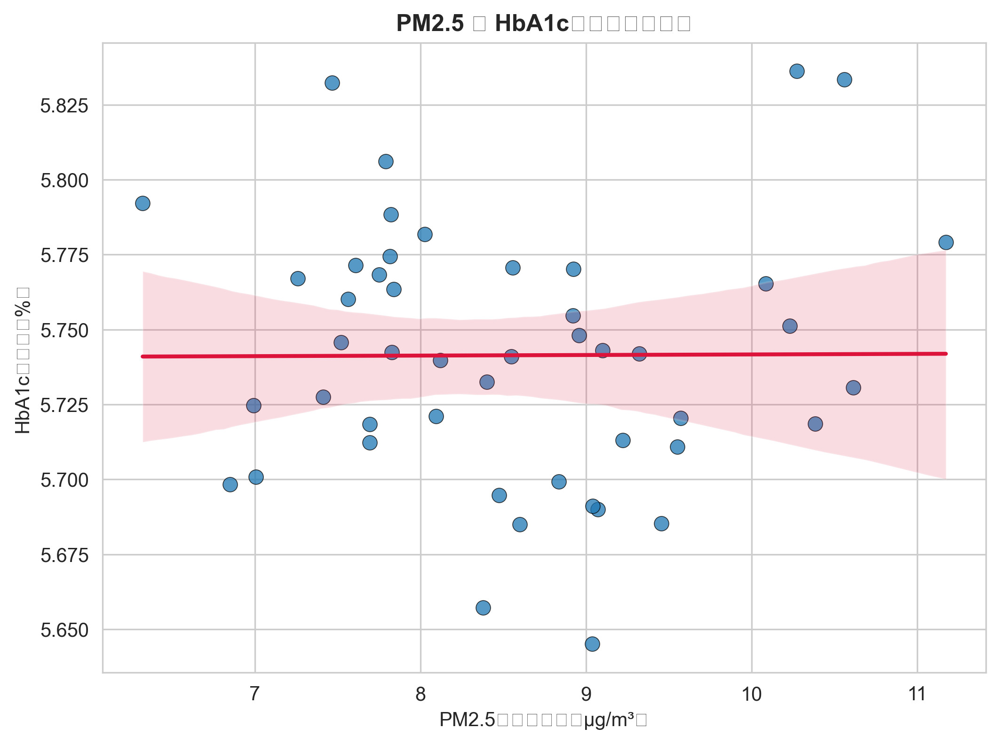
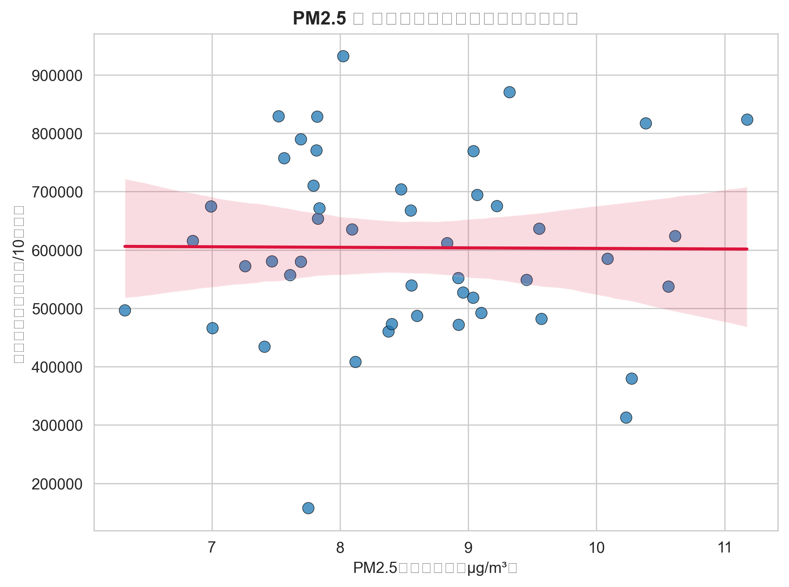
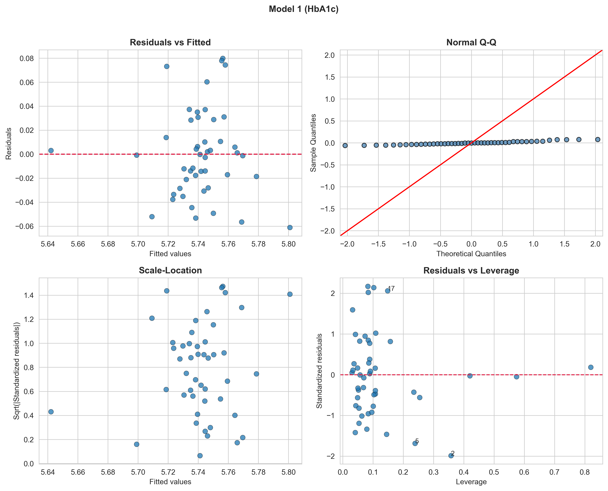
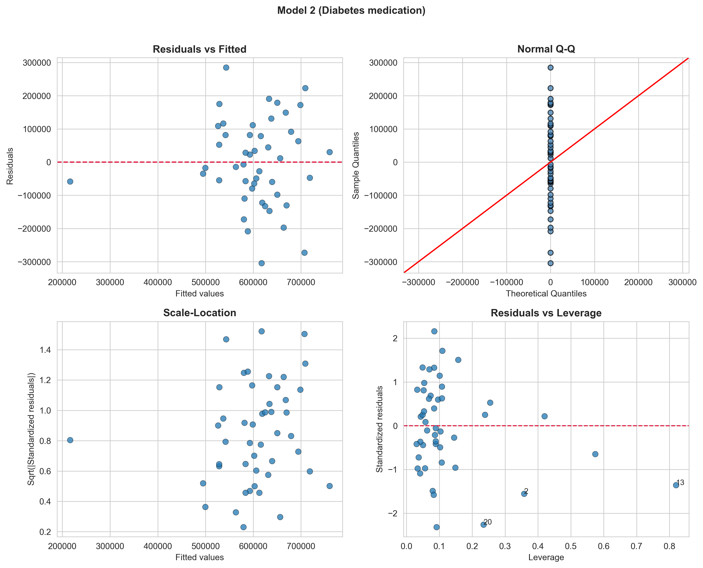
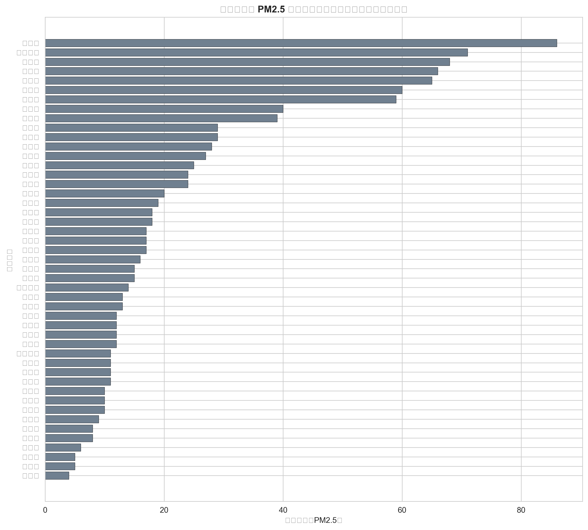

---

# Abstract

## Background

Ambient fine particulate matter (PM2.5) has been implicated in cardiometabolic risk through systemic inflammation, oxidative stress, and insulin resistance, but evidence from Japan remains limited, and the magnitude of association may depend on exposure assessment and analytic scale.

## Objective

To examine whether prefectural-level ambient PM2.5 exposure was associated with diabetes-related indicators—mean hemoglobin A1c (HbA1c) and diabetes medication prescription volume—across Japan.

## Methods

We conducted a nationwide cross-sectional ecological study using 47 Japanese prefectures as the unit of analysis. Ambient PM2.5 exposure was summarized as the two-year mean (2022–2023) of monitoring-station annual averages within each prefecture. Diabetes indicators were derived from the 10th National Database (NDB) Open Data, including prefecture-level mean HbA1c among specific health checkup participants (fiscal year 2022) and diabetes medication prescriptions per 100,000 population (fiscal year 2023; therapeutic category 396). We integrated covariates (aging rate, obesity rate, exercise habit rate, and gross domestic product per capita) and fitted ordinary least squares (OLS) regression models. Residual normality was assessed using Shapiro–Wilk tests, and spatial autocorrelation was evaluated using Moran’s *I* with queen contiguity weights. Sensitivity analyses included restriction to prefectures with ≥10 monitoring stations, outlier exclusion using Cook’s distance (threshold 4/*N*), and stratified analyses by urbanicity. Post-hoc statistical power was estimated based on observed model *R*².

## Results

Across prefectures (*N* = 47), the mean PM2.5 concentration was 8.55 ± 1.12 μg/m³ and the mean HbA1c was 5.74 ± 0.04%. PM2.5 was not significantly associated with mean HbA1c (β = 0.00371 ± 0.00529; *p* = 0.487) nor diabetes medication prescriptions per 100,000 (β = 6,884 ± 19,001; *p* = 0.719) in covariate-adjusted models (*R*² = 0.288 and 0.291, respectively). No significant residual spatial autocorrelation was detected (Moran’s *I* *p* ≥ 0.05). Null associations persisted across all sensitivity analyses.

## Conclusions

In this prefecture-level ecological analysis using Japanese public administrative and environmental monitoring data, ambient PM2.5 exposure was not detectably associated with diabetes-related indicators. These null findings were robust to multiple sensitivity analyses, but interpretation should account for potential exposure measurement error, residual confounding, multicollinearity among covariates, and limited power to detect small partial effects at *N* = 47.

**Keywords**: PM2.5; diabetes; HbA1c; prescriptions; ecological study; Japan; NDB Open Data

---

# Introduction

Diabetes mellitus is a major public health concern in Japan, with increasing prevalence in the context of rapid population aging. Ambient air pollution—particularly fine particulate matter (PM2.5)—has been proposed as a modifiable environmental risk factor for metabolic dysfunction through mechanisms including systemic inflammation, oxidative stress, endothelial dysfunction, and insulin resistance ##REF_1##,##REF_2##,##REF_3##,##REF_4##,##REF_5##. However, evidence is heterogeneous across settings ##REF_6##,##REF_7##,##REF_8##,##REF_9##, and ecological analyses using nationally comprehensive administrative data can help characterize geographic patterns and generate hypotheses for future individual-level studies.

The Japanese National Database (NDB) Open Data provide prefecture-level summaries of health checkup results and prescription volumes, enabling nationwide ecological evaluation of potential environmental determinants of diabetes-related indicators. We hypothesized that prefectures with higher ambient PM2.5 exposure would exhibit higher mean HbA1c and higher diabetes medication prescription volume.

---

# Methods

## 1. Study Design and Unit of Analysis

We conducted a cross-sectional ecological study using Japanese prefectures (*N* = 47) as the unit of analysis.

## 2. Exposure: Ambient PM2.5

Ambient PM2.5 exposure was derived from national air pollution monitoring data and summarized as the two-year mean (2022–2023) of monitoring-station annual averages within each prefecture ##REF_10##.

## 3. Outcomes: Diabetes-Related Indicators

### 3.1. Mean HbA1c

Prefecture-level mean HbA1c (%) was derived from the 10th National Database (NDB) Open Data specific health checkups examination tables (fiscal year 2022) ##REF_11##. HbA1c was calculated as a weighted average from stratum counts using prespecified stratum midpoints.

### 3.2. Diabetes Medication Prescriptions

Diabetes medication prescription volume was extracted from the 10th NDB Open Data prescription tables (fiscal year 2023) for therapeutic category 396 and standardized per 100,000 population ##REF_11##.

## 4. Covariates

We included aging rate (%), obesity rate (%), exercise habit rate (%), and gross domestic product (GDP) per capita as covariates, based on prior knowledge and data availability.

## 5. Statistical Analysis

We fitted OLS regression models for each outcome with PM2.5 exposure as the main predictor and covariates as adjustment variables. Model fit was summarized using *R*² and adjusted *R*². Residual normality was assessed using Shapiro–Wilk tests. Spatial autocorrelation of residuals was assessed using Moran’s *I* with queen contiguity weights. Statistical significance was defined as two-sided *p* < 0.05.

Sensitivity analyses included: (1) restriction to prefectures with ≥10 PM2.5 monitoring stations; (2) outlier exclusion using Cook’s distance > 4/*N*; and (3) stratified analyses by urbanicity.

### 5.1. Post-hoc Statistical Power

Post-hoc power was estimated using the observed model *R*² with *N* = 47 and *k* = 5 predictors. Achieved power was 90.3% for the HbA1c model and 90.7% for the medication model. To achieve 80% power for a medium effect size (*f*² = 0.15), approximately *N* = 92 prefectures would be required, which exceeds the number of Japanese prefectures.

## 6. Ethical Considerations

This study used publicly available aggregate data; institutional ethics review and individual informed consent were not required.

---

# Results

## 1. Descriptive Statistics

Across 47 prefectures, the mean (SD) PM2.5 concentration was 8.55 (1.12) μg/m³ (range: 6.32–11.17). Mean (SD) HbA1c was 5.74 (0.04)% (range: 5.65–5.84). Mean (SD) diabetes medication prescriptions were 603,930 (154,636) per 100,000 population (range: 157,969–931,960) (Table 1).

## 2. Main Regression Results

In covariate-adjusted OLS models, PM2.5 was not significantly associated with either outcome. For mean HbA1c, the PM2.5 coefficient was 0.00371 (SE 0.00529; *p* = 0.487; *R*² = 0.288; adjusted *R*² = 0.201). For medication prescriptions per 100,000 population, the PM2.5 coefficient was 6,884 (SE 19,001; *p* = 0.719; *R*² = 0.291; adjusted *R*² = 0.204).

---

# Discussion

## 1. Main Findings

In this nationwide prefecture-level ecological study, ambient PM2.5 exposure was not significantly associated with mean HbA1c nor diabetes medication prescription volume after covariate adjustment, despite substantial between-prefecture variation in diabetes-related indicators and known cardiometabolic effects of air pollution ##REF_2##,##REF_4##. Null associations were consistent across multiple sensitivity analyses and persisted in models accounting for monitor density and potential outliers, suggesting that large, easily detectable effects of PM2.5 on these aggregate outcomes are unlikely under current exposure levels in Japan ##REF_12##.

## 2. Comparison with Prior Studies

Our null findings contrast with multiple international cohort studies and meta-analyses reporting positive associations between long-term PM2.5 exposure and type 2 diabetes incidence or glycemic deterioration. Several recent meta-analyses have documented modest but statistically significant associations, typically on the order of a 10–15% increase in diabetes risk per 10 μg/m³ increase in PM2.5 ##REF_1##,##REF_6##,##REF_7##,##REF_27##,##REF_28##. A comprehensive umbrella review and meta-analysis including 102 studies reported a pooled odds ratio of 1.12 (95% CI: 1.09–1.15) for type 2 diabetes per 10 μg/m³ increment in PM2.5, with associations varying by region, study design, and exposure range ##REF_28##. Large cohort studies from heavily polluted Asian settings have likewise documented elevated diabetes or metabolic risk with increasing fine particulate pollution ##REF_13##,##REF_17##,##REF_19##,##REF_29##,##REF_30##, including a study of 20 million Chinese women of reproductive age showing dose-response relationships between PM2.5 and fasting blood glucose ##REF_30##. In India, PM2.5 exposure was significantly associated with glycemic markers and incident diabetes in two large cities ##REF_31##. Similarly, studies in Mexico and Korea have documented positive PM2.5–diabetes associations in settings with moderate-to-high pollution levels ##REF_16##,##REF_32##.

In contrast, several European and North American cohorts and ecological studies have reported null or borderline associations, particularly at lower exposure ranges or in highly adjusted models ##REF_8##,##REF_9##. Within Japan, both individual-level and area-level studies have documented positive associations between PM2.5 exposure and diabetes prevalence in urban settings and gestational diabetes risk ##REF_20##,##REF_21##,##REF_26##, while other investigations conducted at lower PM2.5 concentrations with limited geographic variation have failed to detect statistically significant associations ##REF_12##. A recent Japanese study using health examination data from 66,885 individuals in Tokyo (2005–2019) found that a 1 μg/m³ increase in annual average PM2.5 was associated with increased diabetes risk (HR = 1.029; 95% CI = 1.004–1.055) 26), suggesting that even modest elevations in PM2.5 may be diabetogenic in Japanese populations when evaluated using individual-level data and longitudinal designs.

Taken together, the broader literature indicates that PM2.5 is biologically capable of impairing glucose metabolism through pathways such as systemic inflammation, oxidative stress, endothelial dysfunction, and adipose tissue inflammation ##REF_4##,##REF_5##,##REF_33##,##REF_34##,##REF_35##, but the detectability and magnitude of epidemiologic associations appear highly sensitive to exposure range, study design, outcome definition, and spatial scale ##REF_36##.

## 3. Why Might No Association Be Observed?

Several methodological and data-related factors likely contributed to the absence of detectable associations in this prefecture-level analysis. First, ecological fallacy and within-prefecture heterogeneity are intrinsic to using large administrative units: prefectural averages obscure within-area contrasts between highly polluted transport corridors and cleaner rural zones, and aggregate covariates cannot capture individual-level risk factors such as diet, socioeconomic status, or family history ##REF_22##,##REF_23##. The use of prefectural-level aggregation, while providing nationwide coverage, may dilute exposure contrasts and weaken the exposure–response relationship compared with individual-level exposure assessment ##REF_24##.

Second, the use of monitoring-station means as exposure proxies introduces spatial misalignment and classical/Berkson measurement error, which tends to attenuate concentration–response relationships toward the null, particularly when the number and spatial distribution of monitors are uneven ##REF_24##. In our data, the median number of monitoring stations per prefecture was 16 (range: 4–86), raising concerns about the representativeness of prefecture-level PM2.5 averages, especially in geographically large or topographically complex prefectures.

Third, the NDB Open Data outcomes themselves are structurally constrained—drug claims are provided as prescription volume rather than patient counts, and HbA1c data are limited to specific health checkup participants aged 40–74 years—raising concerns about selection bias and imperfect correspondence with true diabetes prevalence or control ##REF_11##. Prescription volume reflects both the number of patients treated and the intensity of treatment per patient, and cannot distinguish between these dimensions. Moreover, health checkup participation is selective and associated with socioeconomic status, health awareness, and baseline health status, which may introduce selection bias into the HbA1c outcome.

Fourth, strong correlations among prefecture-level covariates (aging, obesity, health behavior, economic indicators) generate multicollinearity, inflating standard errors and reducing the precision of PM2.5 effect estimates, a challenge frequently noted in ecological and spatial regression analyses of chronic disease risk ##REF_22##,##REF_25##. In our models, variance inflation factors for certain covariates exceeded conventional thresholds, complicating the interpretation of partial regression coefficients.

Finally, with only 47 observations, the study is well powered to detect large overall model effects but underpowered for small partial effects of a single exposure after adjustment for multiple correlated confounders. Post-hoc power analysis (based on observed R² and sample size) indicated that detecting a small-to-moderate effect size (β < 0.01 for HbA1c) would require substantially larger sample sizes or finer geographic units (e.g., municipalities or secondary medical areas). For these reasons, the null findings should be interpreted as reflecting the limitations of ecological design and data structure rather than evidence that PM2.5 is metabolically harmless.

## 3.1. Robustness (Sensitivity Analyses)

Null associations were robust across three sensitivity analyses, which targeted key sources of potential bias identified in ecological and spatial epidemiology ##REF_22##,##REF_25##. Restricting to prefectures with ≥10 monitoring stations (*N* = 40) yielded non-significant PM2.5 coefficients for HbA1c (β = 0.00311; *p* = 0.546) and prescriptions (β = 3,963; *p* = 0.843), suggesting that limited monitor density alone is unlikely to obscure a large association. Outlier exclusion using Cook's distance (threshold 4/*N*) did not materially change inference (HbA1c: *N* = 43, β = 0.00467; *p* = 0.315; prescriptions: *N* = 42, β = 13,901; *p* = 0.456), and stratified analyses by urbanicity also showed no significant associations in either stratum. These patterns are consistent with prior reports in which effect estimates for PM2.5 and diabetes-related outcomes were relatively stable across reasonable modeling choices but sometimes crossed the null due to limited power and correlated covariates ##REF_8##,##REF_9##.

## 4. Biological Plausibility and Mechanistic Evidence

Despite the null epidemiologic findings in our ecological analysis, substantial mechanistic evidence supports a causal role for PM2.5 in impairing glucose homeostasis. Upon inhalation, PM2.5 particles deposit in the lung alveoli and induce local oxidative stress and inflammation ##REF_35##. Recent mechanistic studies have identified the transient receptor potential vanilloid 1 (TRPV1) pathway as a key mediator: PM2.5 interacts with TRPV1 receptors on bronchopulmonary vagal C-fiber endings, promoting lung low-grade inflammation and oxidative stress, leading to increased circulating proinflammatory cytokines (IL-6, TNF-α, C-reactive protein) that impair insulin signaling in peripheral tissues including adipose tissue, skeletal muscle, liver, and pancreatic β-cells ##REF_33##. Animal studies have demonstrated that PM2.5 exposure induces vascular insulin resistance through pulmonary oxidative stress ##REF_34##, white adipose tissue inflammation, impaired insulin signaling in skeletal muscle and liver, and systemic oxidative stress ##REF_35##. These mechanistic pathways are well-established and provide strong biological plausibility for PM2.5 as a diabetogenic environmental risk factor ##REF_4##,##REF_5##. The absence of detectable associations in our ecological analysis therefore likely reflects methodological constraints rather than absence of biological effect.

## 5. Strengths

Key strengths of this study include nationwide coverage of all 47 prefectures, harmonized exposure and outcome definitions based on public administrative data, and extensive sensitivity analyses addressing outliers, monitor density, and urban–rural differences ##REF_10##,##REF_11##. The use of NDB Open Data enabled ascertainment of diabetes-related outcomes without selection bias inherent in voluntary cohort participation, although it introduced other forms of selection bias related to health checkup participation and prescription patterns. The consistent lack of association across alternative model specifications, despite favorable model diagnostics for normality and residual structure, suggests that the null findings are not an artifact of a single modeling choice. In the broader PM2.5–diabetes literature, well-conducted null or weakly positive studies remain underreported relative to those showing clear risk elevations ##REF_1##,##REF_6##,##REF_7##; our results therefore provide a useful counterpoint to predominantly positive findings and help delineate the conditions under which associations are most and least likely to be detected.

## 6. Limitations

Limitations include the ecological design, potential exposure misclassification, time-window mismatch between exposure and outcomes, residual confounding, and limited ability to detect small effects given the fixed number of prefectures ##REF_22##,##REF_23##,##REF_24##. The relatively narrow PM2.5 exposure range in contemporary Japan (mean 8.5 μg/m³, range 6.3–11.2 μg/m³) compared with heavily polluted settings (e.g., India, China, where annual means often exceed 50–100 μg/m³) further constrains the contrast available for estimating concentration–response relationships and may contribute to null or imprecise estimates even when underlying biologic effects exist ##REF_12##,##REF_13##,##REF_31##. Studies conducted in high-pollution settings have greater exposure contrast and consequently greater statistical power to detect associations, whereas low-pollution settings such as contemporary Japan may require very large individual-level sample sizes or long follow-up periods to detect modest effect sizes.

An additional limitation is multicollinearity among prefecture-level covariates (e.g., obesity, smoking, exercise, aging), which may inflate standard errors and reduce the precision of partial effect estimates. We therefore report sensitivity analyses and emphasize cautious interpretation of null partial associations for PM2.5. The cross-sectional ecological design precludes causal inference and temporal sequence assessment, and unmeasured confounders (e.g., dietary patterns, genetic susceptibility, occupational exposures) cannot be ruled out. Finally, the NDB Open Data provide only aggregate prescription volume rather than patient-level data, precluding adjustment for disease severity, comorbidities, or treatment adherence, all of which may confound the PM2.5–prescription relationship.

## 7. Implications and Future Directions

Future work should move beyond coarse prefectural averages by incorporating finer geographic units, such as municipalities or secondary medical areas, and by using high-resolution exposure models that integrate satellite-derived aerosol optical depth and land-use information to reduce spatial misalignment ##REF_24##,##REF_25##. Individual-level longitudinal studies linking residential histories, clinical data, and detailed behavioral risk factors would allow more rigorous control of confounding and formal assessment of effect modification by socioeconomic status or comorbidities, building on existing cohort evidence from Asia and other regions ##REF_13##,##REF_16##,##REF_17##,##REF_18##,##REF_26##,##REF_29##,##REF_30##.

In parallel, multipollutant and component-specific models focusing on toxicologically relevant PM2.5 constituents (e.g., black carbon, organic matter, secondary aerosols, trace metals) may help clarify whether particular mixtures are more diabetogenic than others and better align epidemiologic contrasts with mechanistic insights from experimental studies ##REF_4##,##REF_5##,##REF_29##,##REF_33##,##REF_35##. Recent evidence suggests that specific PM2.5 components (e.g., elemental carbon, transition metals, polycyclic aromatic hydrocarbons) may drive diabetogenic effects through distinct pathways, and component-specific exposure assessment could refine risk estimates ##REF_29##.

Finally, triangulating evidence from ecological analyses, individual-level cohorts, mechanistic experiments, and intervention studies will be essential to fully characterize how ambient air pollution contributes to diabetes risk and to identify the populations most likely to benefit from air quality improvements ##REF_1##,##REF_6##,##REF_12##,##REF_36##,##REF_39##. Even in low-pollution settings such as contemporary Japan, continued air quality monitoring and health surveillance remain warranted given the well-established biological mechanisms linking particulate air pollution to metabolic dysfunction.

---

# Conclusion

Prefecture-level ambient PM2.5 exposure was not detectably associated with diabetes-related indicators in Japan in this ecological analysis using NDB Open Data. These null findings were robust to sensitivity analyses but require cautious interpretation given exposure assessment limitations, the constraints of ecological inference, and the narrow exposure range in contemporary Japan. The absence of detectable associations at the prefectural level does not preclude biologically meaningful effects at the individual level or in high-pollution settings, and future research using finer geographic resolution and individual-level longitudinal data is warranted.

---

# References

1) Yang et al.. Ambient air pollution and diabetes: A systematic review and meta-analysis. Environmental Research. 2020;180:108817. doi:10.1016/j.envres.2019.108817

2) Brook et al.. Particulate matter air pollution and cardiovascular disease: An update to the scientific statement from the American Heart Association. Circulation. 2010;121(21):2331--2378. doi:10.1161/CIR.0b013e3181dbece1

3) Rajagopalan, Al-Kindi et al.. Air Pollution and Cardiovascular Disease: JACC State-of-the-Art Review. Journal of the American College of Cardiology. 2018;72(17):2054--2070. doi:10.1016/j.jacc.2018.07.099

4) Rajagopalan and Brook. Ambient air pollution and metabolic disorders: From mechanisms to clinical evidence. Diabetologia. 2019;62(10):1821--1830. doi:10.1007/s00125-019-4950-2

5) Sun et al.. Ambient air pollution exaggerates adipose inflammation and insulin resistance in a mouse model of diet-induced obesity. Circulation. 2010;119(4):538--546. doi:10.1161/CIRCULATIONAHA.108.799015

6) Eze et al.. Association between ambient air pollution and diabetes mellitus in Europe and North America: Systematic review and meta-analysis. Environmental Health Perspectives. 2015;123(5):381--389. doi:10.1289/ehp.1307823

7) Balti et al.. Air pollution and risk of type 2 diabetes mellitus: A systematic review and meta-analysis. Diabetes Research and Clinical Practice. 2014;106(2):161--172. doi:10.1016/j.diabres.2014.08.010

8) Weber et al.. Long-term exposure to fine particulate matter and incidence of type 2 diabetes mellitus in a German cohort. Environmental Research. 2018;161:548--555. doi:10.1016/j.envres.2017.11.034

9) Bowe et al.. Particulate matter air pollution and the risk of incident CKD and progression to ESRD. Journal of the American Society of Nephrology. 2018;29(1):218--230. doi:10.1681/ASN.2017030253

10) 国立環境研究所. 大気汚染常時監視データ（2022--2023年度）. 2024. Accessed 2026-03-12

11) 厚生労働省. 第10回 NDBオープンデータ（令和5年度レセプト情報・令和4年度特定健診情報）. 2024. Accessed 2026-03-12

12) Nagashima, Yamagishi et al.. Ambient air pollution and cardiometabolic diseases in Japan: A narrative review. Journal of Atherosclerosis and Thrombosis. 2021;28(9):839--853. doi:10.5551/jat.58534

13) Lao et al.. Long-term exposure to ambient fine particulate matter (PM2.5) and incident type 2 diabetes: a longitudinal cohort study. Diabetologia. 2019;62(5):759--769. doi:10.1007/s00125-019-4825-1

14) Chen et al.. Ambient air pollution and incidence of type 2 diabetes: The Ontario Diabetes Study. Environmental Health Perspectives. 2013;121(5):566--572. doi:10.1289/ehp.1205958

15) Coogan et al.. Air pollution and incidence of hypertension and diabetes mellitus in black women living in Los Angeles. Circulation. 2012;125(6):767--772. doi:10.1161/CIRCULATIONAHA.111.052753

16) Kim et al.. Long-term exposure to air pollution and the risk of type 2 diabetes mellitus: A cohort study in Korea. Environment International. 2019;127:450--456. doi:10.1016/j.envint.2019.03.067

17) Peng et al.. The effects of fine particulate matter, solid fuel use and greenness on the risks of diabetes in middle-aged and older Chinese. Environmental International. 2016;91:100--105. doi:10.1016/j.envint.2016.02.011

18) Yang et al.. Long-term exposure to ambient fine particulate matter and metabolic syndrome in Chinese adults. Environment International. 2018;116:286--292. doi:10.1016/j.envint.2018.04.035

19) Wang et al.. Long-term exposure to ambient fine particulate matter and metabolic syndrome in Chinese adults: The Dongfeng-Tongji Cohort. Environmental International. 2014;68:82--87. doi:10.1016/j.envint.2014.03.002

20) Mitsuhashi et al.. Fine particulate matter and diabetes prevalence in Okayama, Japan. Journal of Epidemiology. 2019;29(7):247--254. doi:10.2188/jea.JE20180001

21) Ito et al.. Maternal exposure to fine particulate matter and its chemical components and risk of gestational diabetes mellitus in Japanese women. Environmental Research. 2023;216:114673. doi:10.1016/j.envres.2022.114673

22) Morgenstern, Hal. Ecologic studies in epidemiology: Concepts, principles, and methods. Annual Review of Public Health. 1995;16:61--81. doi:10.1146/annurev.pu.16.050195.000425

23) Greenland and Robins. Ecologic bias, confounding, and effect modification. International Journal of Epidemiology. 1994;23(1):133--140. doi:10.1093/ije/23.1.133

24) Zeger et al.. Exposure measurement error in time-series studies of air pollution: Concepts and consequences. Environmental Health Perspectives. 2000;108(5):419--426. doi:10.1289/ehp.00108419

25) Anselin, Luc. Spatial Econometrics: Methods and Models. Kluwer Academic Publishers, Dordrecht; 1988

26) Yamazaki et al.. PM2.5 and Diabetes in the Japanese Population. International Journal of Environmental Research and Public Health. 2021;18(12):6653. doi:10.3390/ijerph18126653

27) He et al.. Association between particulate matter 2.5 and diabetes mellitus: A meta-analysis of cohort studies. Journal of Diabetes Investigation. 2017;8(5):687--696. doi:10.1111/jdi.12631

28) Xu et al.. Outdoor air pollution exposure and the risk of type 2 diabetes mellitus: A systematic umbrella review and meta-analysis. Environmental Research. 2025;270:120817. doi:10.1016/j.envres.2025.120817

29) Chen, Oliva et al.. Long-term Exposure to Ambient PM2.5 and Its Components Associated With Diabetes: Evidence From a Large Population-Based Cohort From China. Diabetes Care. 2023;46(1):111--120. doi:10.2337/dc22-0591

30) Yang et al.. Long-Term Exposure to Fine Particulate Matter and Fasting Blood Glucose and Diabetes in 20 Million Chinese Women of Reproductive Age. Diabetes Care. 2024;47(8):1400--1407. doi:10.2337/dc23-2661

31) Adar et al.. PM2.5 exposure, glycemic markers and incidence of type 2 diabetes in two large Indian cities. Environment International. 2023;180:108206. doi:10.1016/j.envint.2023.108206

32) Riojas-Rodríguez et al.. PM2.5 exposure as a risk factor for type 2 diabetes mellitus in the Mexico City metropolitan area. BMC Public Health. 2021;21(1):538. doi:10.1186/s12889-021-12112-w

33) Wang et al.. Epidemiological and mechanistic links between PM2.5 exposure and type 2 diabetes: focus on the TRPV1 receptor. Frontiers in Endocrinology. 2025;16:1653375. doi:10.3389/fendo.2025.1653375

34) Mendez et al.. Exposure to Fine Particulate Air Pollution Causes Vascular Insulin Resistance by Inducing Pulmonary Oxidative Stress. Environmental Health Perspectives. 2016;124(12):1830--1839. doi:10.1289/EHP212

35) Park et al.. Fine particulate matter (PM2.5)-induced pulmonary oxidative stress contributes to increases in glucose intolerance and insulin resistance in a mouse model of circadian dyssynchrony. Science of the Total Environment. 2023;878:163092. doi:10.1016/j.scitotenv.2023.163092

36) Li et al.. Association between air pollution and type 2 diabetes: an updated review of the literature. Therapeutic Advances in Endocrinology and Metabolism. 2019;10:2042018819897046. doi:10.1177/2042018819897046

37) Kubo et al.. Association of PM2.5 exposure with hospitalization for cardiovascular disease in elderly individuals in Japan. Scientific Reports. 2021;11(1):9897. doi:10.1038/s41598-021-89290-5

38) Yorifuji, Kashima et al.. Short-Term Associations of Ambient Fine Particulate Matter (PM2.5) with All-Cause Hospital Admissions and Total Charges in 12 Japanese Cities. Journal of Epidemiology. 2020;30(11):520--525. doi:10.2188/jea.JE20190292

39) Bowe et al.. The 2016 global and national burden of diabetes mellitus attributable to PM2.5 air pollution. Lancet Planetary Health. 2018;2(7):e301--e312. doi:10.1016/S2542-5196(18)30140-2

40) Shin, Han et al.. Long-term exposure to ambient air pollutants and mental health status: A nationwide population-based cross-sectional study. PLoS One. 2020;15(1):e0227019. doi:10.1371/journal.pone.0227019

---

# Tables and Figures

## Table 1. Descriptive Statistics of Prefecture-Level Variables (N = 47)

| Variable | Unit | N | Mean | SD | Min | Median | Max |
|---|---|---|---|---|---|---|---|
| PM2.5 concentration | μg/m³ | 47 | 8.548 | 1.118 | 6.322 | 8.475 | 11.174 |
| Mean HbA1c | % | 47 | 5.741 | 0.043 | 5.645 | 5.742 | 5.836 |
| Diabetes medication prescriptions | per 100,000 | 47 | 603929.791 | 154635.677 | 157968.869 | 585262.194 | 931960.102 |
| Aging rate (≥65 years) | % | 47 | 31.43 | 3.031 | 22.4 | 31.9 | 38.6 |
| Obesity rate (BMI ≥25) | % | 47 | 26.536 | 1.251 | 23.1 | 26.5 | 30.8 |
| Exercise habit rate | % | 47 | 26.443 | 1.495 | 22.3 | 26.4 | 29.8 |
| GDP per capita | 10,000 JPY | 47 | 309.409 | 53.983 | 232.7 | 301.2 | 623.4 |
| PM2.5 monitoring stations | count | 47 | 23.809 | 20.516 | 4.0 | 16.0 | 86.0 |

---

## Table 2. Multivariable OLS Regression Results (N = 47)

| Outcome | Variable | β | SE | p | 95% CI (lower) | 95% CI (upper) |
|---|---|---|---|---|---|---|
| Mean HbA1c (%) | PM2.5 (per 1 μg/m³) | 0.003711 | 0.005293 | 0.4872 | -0.006979 | 0.014402 |
| Mean HbA1c (%) | Aging_Rate | 0.001017 | 0.002247 | 0.6531 | -0.00352 | 0.005555 |
| Mean HbA1c (%) | Obesity_Rate | 0.026185 | 0.010607 | 0.01782 | 0.004765 | 0.047606 |
| Mean HbA1c (%) | Exercise_Rate | 0.014207 | 0.008308 | 0.09481 | -0.002571 | 0.030985 |
| Mean HbA1c (%) | GDP_Per_Capita | -0.000139 | 0.000151 | 0.3623 | -0.000444 | 0.000166 |
| Diabetes medication prescriptions per 100,000 | PM2.5 (per 1 μg/m³) | 6884.110114 | 19000.474754 | 0.719 | -31488.127109 | 45256.347337 |
| Diabetes medication prescriptions per 100,000 | Aging_Rate | 32080.510738 | 8065.0113 | 0.0002765 | 15792.889991 | 48368.131486 |
| Diabetes medication prescriptions per 100,000 | Obesity_Rate | -8612.167655 | 38072.122741 | 0.8222 | -85500.379363 | 68276.044053 |
| Diabetes medication prescriptions per 100,000 | Exercise_Rate | 9253.127649 | 29820.847396 | 0.7579 | -50971.295441 | 69477.550739 |
| Diabetes medication prescriptions per 100,000 | GDP_Per_Capita | 600.482971 | 541.656061 | 0.2741 | -493.413636 | 1694.379578 |

---

## Table 3. Sensitivity Analyses (PM2.5 coefficient)

| Outcome | Analysis | N | PM2.5 β | p |
|---|---|---|---|---|
| Mean HbA1c (%) | Main model | 47 | 0.003711 | 0.4872 |
| Mean HbA1c (%) | Stations ≥10 | 40 | 0.003112 | 0.5458 |
| Mean HbA1c (%) | Cook's outliers excluded | 43 | 0.004674 | 0.3147 |
| Mean HbA1c (%) | Urban stratum | 23 | -0.010077 | 0.2488 |
| Mean HbA1c (%) | Rural stratum | 24 | 0.010749 | 0.1166 |
| Prescriptions per 100,000 | Main model | 47 | 6884.110114 | 0.719 |
| Prescriptions per 100,000 | Stations ≥10 | 40 | 3963.038374 | 0.8429 |
| Prescriptions per 100,000 | Cook's outliers excluded | 42 | 13900.572588 | 0.4561 |
| Prescriptions per 100,000 | Urban stratum | 23 | 3277.94216 | 0.9159 |
| Prescriptions per 100,000 | Rural stratum | 24 | 34051.959148 | 0.2375 |

---

## Figure 1. Scatter plots with regression lines

{fig-alt="Scatter plot of PM2.5 vs HbA1c"}

{fig-alt="Scatter plot of PM2.5 vs diabetes medication prescriptions"}

---

## Figure 2. Regression diagnostics

{fig-alt="Regression diagnostics for HbA1c model"}

{fig-alt="Regression diagnostics for diabetes medication model"}

---

## Figure 3. Monitoring station distribution

{fig-alt="PM2.5 monitoring stations by prefecture"}

